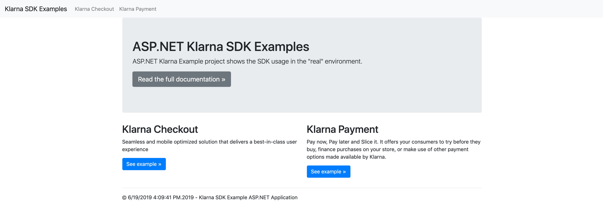
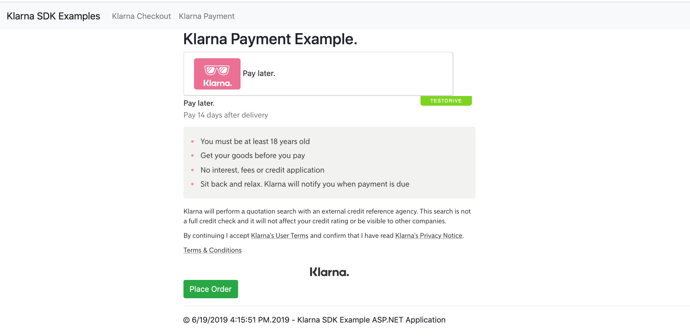

# ASP.NET [MVC Web App](https://dotnet.microsoft.com/apps/aspnet/mvc) Sample Project

==================================================================================

This ASP.NET MVC sample project demonstrates how to work with the Klarna Checkout and Klarna Payments APIs by utilizing the Klarna .NET Core SDK.

## Run Project

Use IIS server or Visual Studio to run the Solution.

**Note**: Follow the [Microsoft guidelines](https://docs.microsoft.com/en-us/visualstudio/ide/quickstart-aspnet-core?view=vs-2019)
on building and running the project.

The project serves on [http://localhost:8080](http://localhost:8080) by default.

### Project Credentials

> Remember to set `$MERCHANT_ID$` and `$PASSWORD$` to your account's values in [Controllers/HomeController.cs](Klarna.Rest/SampleProjects/KlarnaCheckoutWebApp/KlarnaCheckoutWebApp/Controllers/HomeController.cs) to be able to get the Checkout snippet and render the Payment form.
> More about authentication [here](https://developers.klarna.com/api/#authentication)

## Demo and Results

After running the project you will find two example flows: **Klarna Checkout** and **Klarna Payment**.
Click the "See example" button to see the demo page.

* Main page

  

* Klarna payments demo

  

### Credits

This project makes use of imagery found on [https://www.pexels.com/](https://www.pexels.com), licensed under [https://www.pexels.com/photo-license/](https://www.pexels.com/photo-license/)
