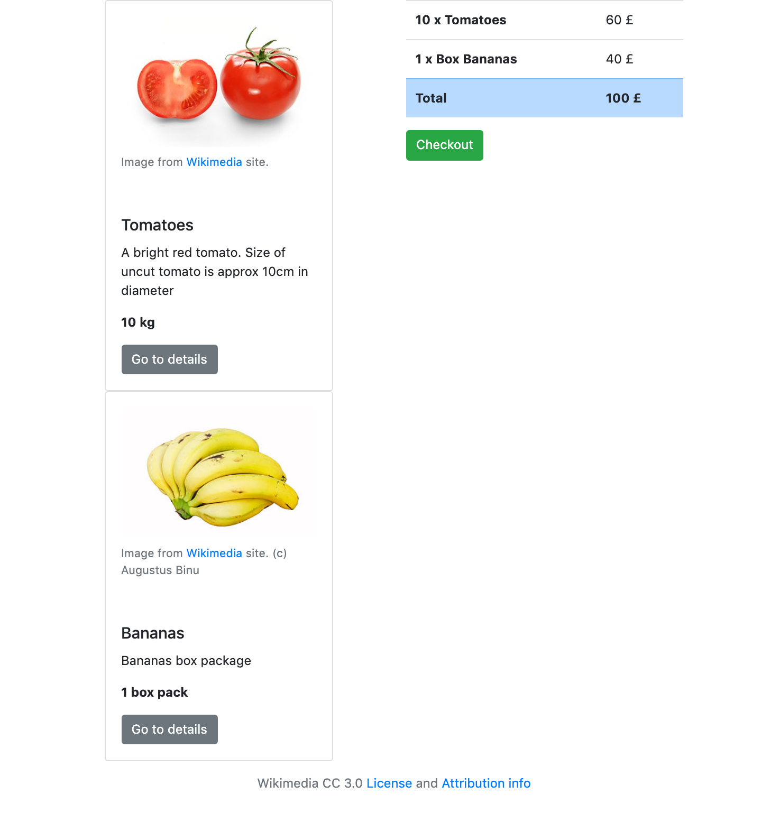
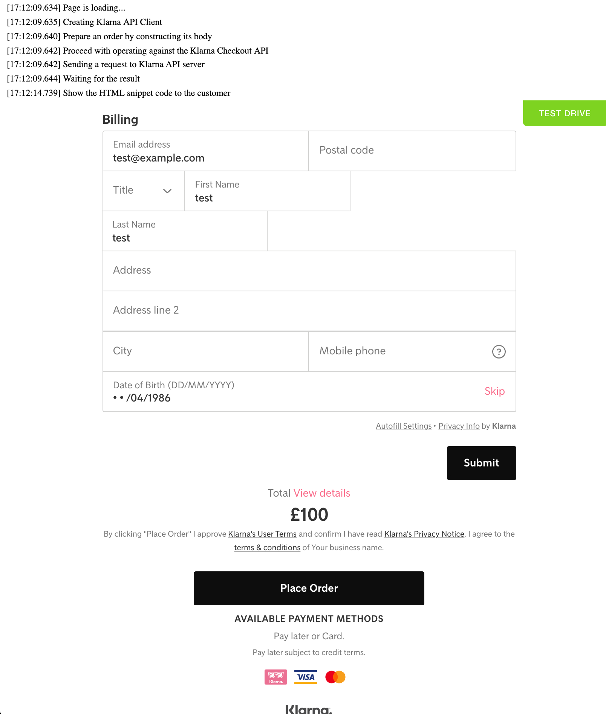

# ASP.NET [Web Forms](https://dotnet.microsoft.com/apps/aspnet/web-forms) Sample Project

The ASP.NET Web Forms sample project demonstrates the simple use case "How to generate the Klarna Checkout"

## Run Project

Use IIS server or Visual Studio to run the Solution.  

> **Note**: Follow the [Microsoft guidelines](https://docs.microsoft.com/en-us/aspnet/web-forms/overview/getting-started/getting-started-with-aspnet-45-web-forms/introduction-and-overview)
on building and running the project

The project serves on http://localhost:8080 by default.

## Special case

Due to the Web Forms limitations be careful with using `Task.Result` in the **Main** thread:
[https://blogs.msdn.microsoft.com/jpsanders/2017/08/28/asp-net-do-not-use-task-result-in-main-context/](https://blogs.msdn.microsoft.com/jpsanders/2017/08/28/asp-net-do-not-use-task-result-in-main-context/)

The Klarna .NET Core SDK uses [async Tasks](https://docs.microsoft.com/en-us/dotnet/csharp/programming-guide/concepts/async/) by default, so you need to create a new `Task` in order to avoid deadlocks.  

Check the example code in [Checkout.aspx.cs](WebForms/Checkout.aspx/Checkout.aspx.cs)

## Demo and Results

All the steps in the [Checkout.aspx.cs](WebForms/Checkout.aspx.cs) file are covered by comments and logging statements. Check the source code and use your browser to render the HTML Snippet returned by the call to the [Klarna Checkout API](https://developers.klarna.com/api/#checkout-api).

> Remember to set `$MERCHANT_ID$` and `$PASSWORD$` to your account's values  
> Read more about authentication [here](https://developers.klarna.com/api/#authentication).

* Initial state

  

* Rendering the checkout

  

### Credits

This project makes use of imagery found on [https://www.pexels.com/](https://www.pexels.com), licensed under [https://www.pexels.com/photo-license/](https://www.pexels.com/photo-license/)
